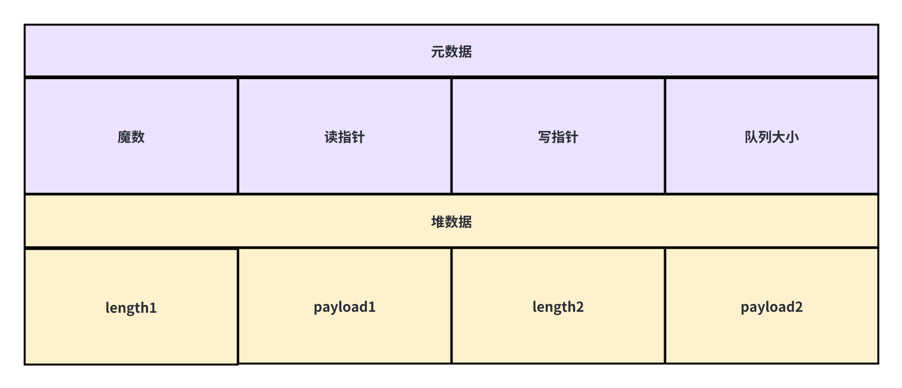
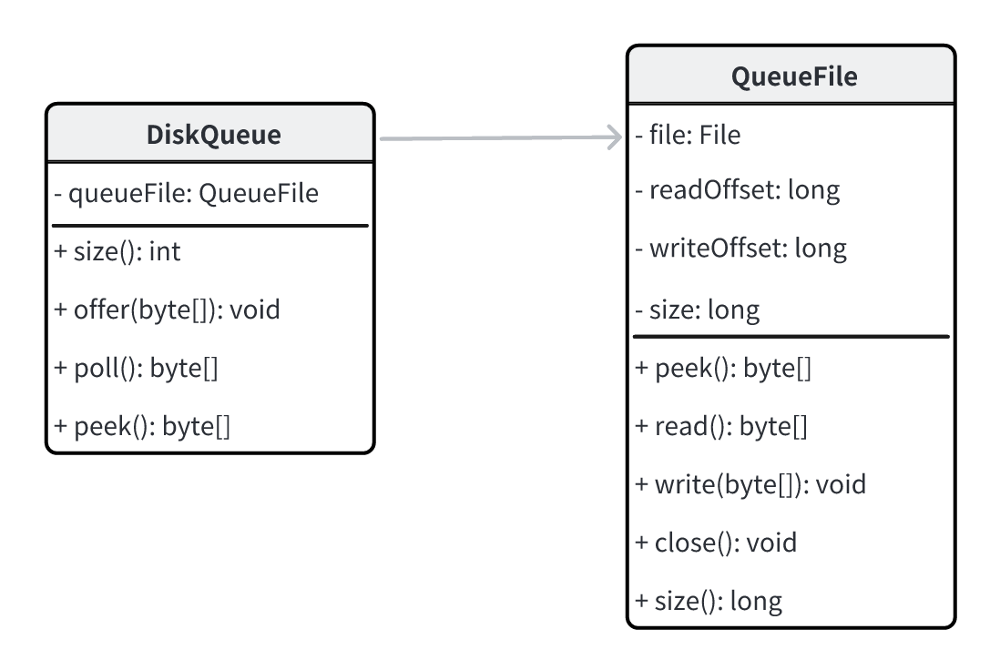
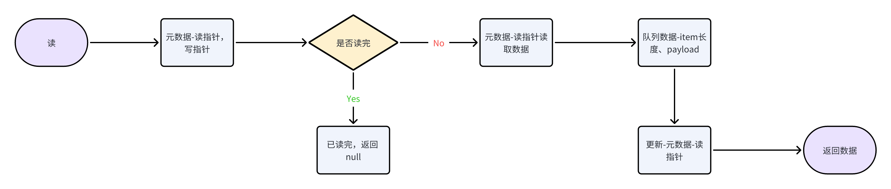
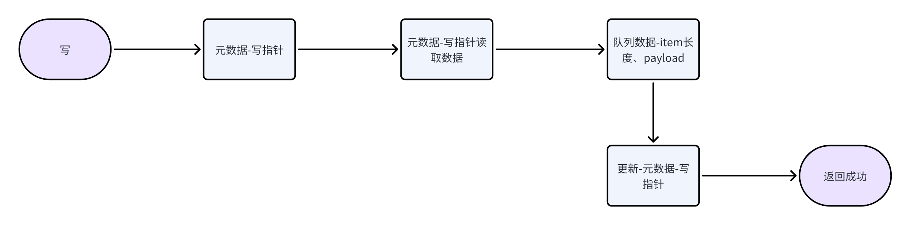
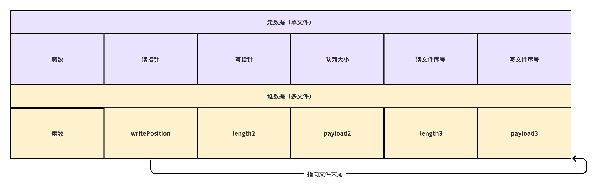
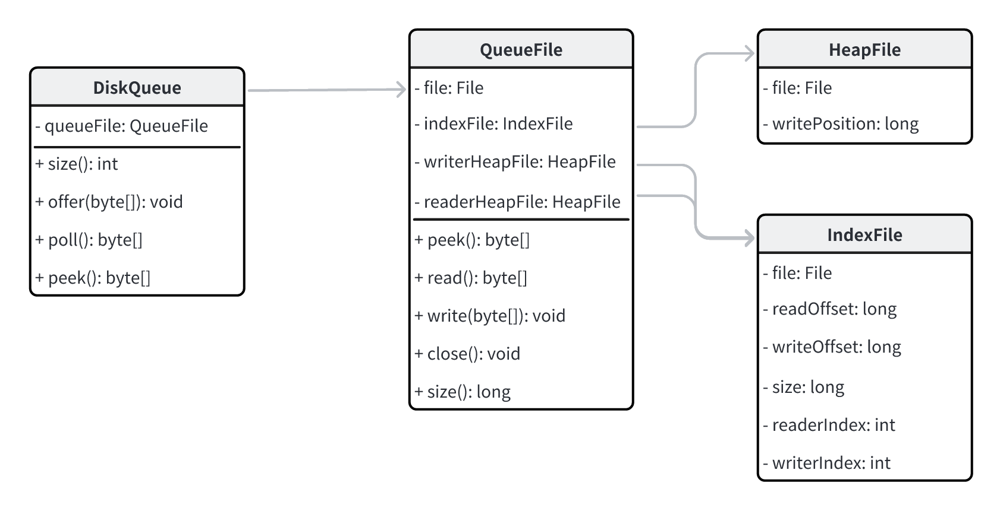

# diskqueue持久化队列设计演进

> 一步一步推导演进持久化磁盘队列的设计与实现。

*在方向不明确，不够熟练的情况下，从 demo 做起，一步步学习先进的设计理念并付诸行动。*

---

## 第一版，单文件持久化队列
- 元数据、堆数据存储在一个文件中；
- 元数据：记录读、写消费指针，队列大小；
- 堆数据：item 长度、数据；
- 元数据 + 堆数据单文件存储；

UML类图：

读：

写：

---

## 第二版，多文件持久化队列
- 元数据、堆数据存储在不同文件中；
- 元数据：记录读、写消费指针，队列大小；
- 堆数据：item 长度、数据；
- 元数据 + 堆数据单文件存储；
  

优化点：
1. 刷盘策略：
   1. 刷盘线程，频率可配置
2. 时间戳：
   1. 按时间清除数据
3. Page 读取：
   1. HeapFile、MetaFile 按照页组织
4. Cache 策略：
   1. 增加读、写命中率
---

## 第三版，多消费者（Fanout）持久化队列
- 元数据、堆数据存储在不同文件中；
- 元数据：记录多个消费者读、写消费指针，队列大小；
- 堆数据：item 长度、数据；
- 元数据 + 堆数据单文件存储；

